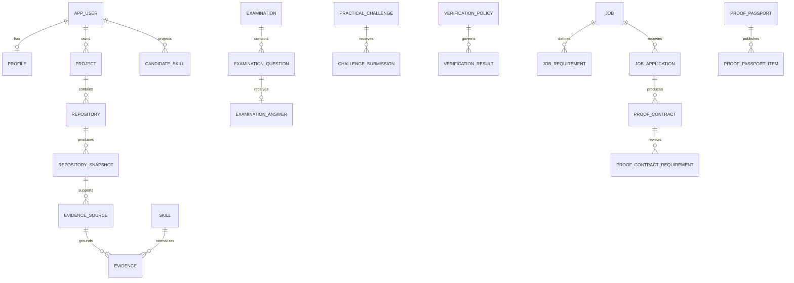

# Database schema

Flyway migrations live under `backend/src/main/resources/db/migration`:

- `V1__core_proof_schema.sql`: identity, taxonomy, projects, snapshots, evidence, examinations, challenges, policies, verification history, jobs, passports, disputes, audit
- `V2__auth_github_analysis.sql`: refresh sessions, OAuth state/connection, repository metadata, async analysis jobs, GitHub taxonomy seed
- `V3__verification_recruiter_passport.sql`: applications, proof contracts, contract requirements, baseline policy seed, answer uniqueness/indexes

## Core relationships

## Important invariants

- one `skill` row per normalized taxonomy node; aliases and relationships are separate
- candidate skill status is a projection; immutable `verification_result` rows preserve decisions
- evidence points to an immutable repository snapshot and private-by-default source
- recruiter contracts count only explicitly recruiter-visible evidence and may expose policy summaries without raw source
- proof passport items reference verified results and publish their own safe display summary
- applications and contracts are scoped by candidate/job ownership
- all important mutations create `audit_log` entries

## JSONB boundaries

JSONB is used for deterministic facts, redaction summary, evidence context references, challenge acceptance criteria, execution summary, policy rules, evaluator metadata, and audit metadata. Users, skills, evidence, jobs, permissions, and verification history remain relational.

## Retention and deletion

Account deletion must cascade or anonymize according to retention policy. Private source artifacts and provider tokens have independent retention. Historical verification may be retained as a redacted audit record where legally required, but public proof must be revocable and expirable.
