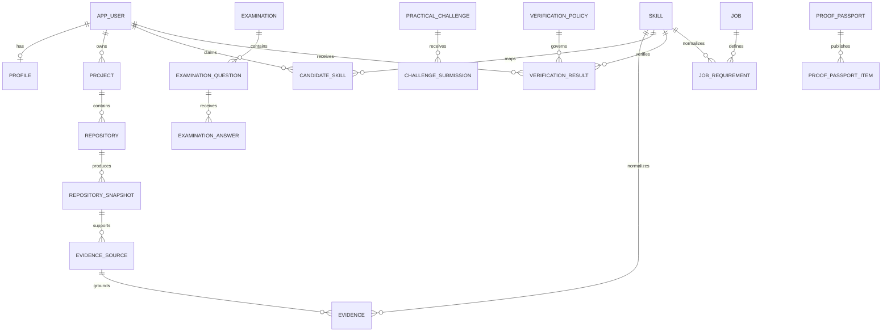

# Database schema

The first Flyway migration is `backend/src/main/resources/db/migration/V1__core_proof_schema.sql`.

## Core relationships

## Normalization rules

- one `skill` row per normalized taxonomy node
- `skill_alias` and `skill_relationship` handle synonyms/hierarchy
- candidate status is a derived projection in `candidate_skill`, while immutable `verification_result` records history
- evidence points to an immutable repository snapshot and source location
- examination answers are separate from questions and record evaluator metadata
- job requirements preserve original source phrases and recruiter edits
- public passport items reference a verification result but have their own visibility and display summary

## JSONB boundaries

Use JSONB for provider-specific or evolving data where relational querying is not core:

- deterministic facts
- redaction summary
- context references
- acceptance criteria
- execution summary
- policy rules
- model metadata
- audit metadata

Do not use a JSON blob for users, skills, evidence, permissions, jobs, or verification history.

## Indexes

Important access patterns have indexes in V1:

- candidate skills by candidate/status/freshness
- projects by candidate/updated time
- snapshots by analysis state
- evidence by candidate/skill and project
- examinations by candidate/time
- verification history by candidate/skill/time
- passports by public identifier when not revoked
- audit by resource and actor
- notifications by user/read state/time

## Retention and deletion

Account deletion must cascade or anonymize according to retention policy. Private source artifacts and provider tokens have independent retention. Historical verification may be retained as a redacted audit record where legally required, but public proof must be revocable.
