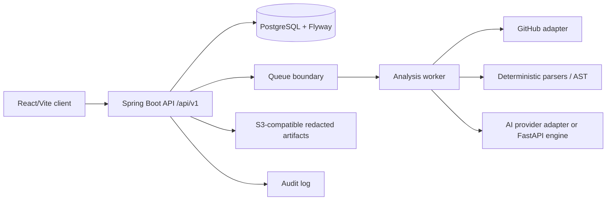

# System architecture

## Current boundary



The working preview is a browser-local adapter around the same domain language. It is intentionally explicit about the boundary so a live backend can replace it without redesigning the product.

## Modular monolith first

Spring Boot owns the system of record and domain boundaries:

- `auth`: identities, sessions, OAuth, recovery
- `users` / `profiles`: candidate data and visibility
- `organizations` / `institutions`: membership, departments, batches
- `projects` / `github`: repositories, snapshots, provider adapters
- `skills`: normalized taxonomy, aliases, relationships
- `evidence`: sources, observations, visibility, provenance
- `examinations`: bounded sessions, questions, answers, evaluation records
- `challenges`: practical tasks, sandbox references, submissions
- `verification`: policies, results, freshness, disputes
- `jobs`: job descriptions and proof contracts
- `proof`: passports, public summaries, sharing/revocation
- `credentials`: issuer, signed artifacts, status
- `analytics`: aggregate, non-sensitive product metrics
- `notifications` / `audit`: user messaging and reconstruction trail

Avoid network calls between these modules. Use application services and domain events internally. Extract a worker or service only when load, isolation, or security warrants it.

## Analysis lifecycle

```text
POST /projects/{id}/analysis
  -> create job (QUEUED)
  -> fetch permitted repository metadata
  -> create immutable snapshot
  -> secret scan and redaction
  -> deterministic language/dependency/AST passes
  -> select relevant context
  -> persist deterministic evidence + normalized skills
  -> optional grounded provider adapter with schema/prompt version
  -> validate every provider reference before use
  -> policy-owned examination/practical/verification flow
  -> publish notification
```

HTTP requests do not wait for repository analysis. Every long-running job has a state, retry count, failure code, and request ID.

## Data separation

- PostgreSQL stores normalized entities and bounded JSONB for provider metadata.
- Object storage holds encrypted/redacted artifacts with retention and delete markers.
- Private source never enters a public passport.
- Raw provider secrets are encrypted separately or not stored after use.
- AI prompts receive selected redacted context, not an entire repository by default.

## API and client

The client uses React Router for navigation and local state only for the demo adapter. Production server state should use TanStack Query with:

- request cancellation
- optimistic updates only for non-critical UI
- cache keys by candidate/project/snapshot
- explicit mutation states
- permission-aware empty states

All APIs are versioned at `/api/v1`, return a consistent error envelope, and include a request ID.

## Reliability and observability

- structured JSON logs with request/job IDs
- metrics for analysis latency, provider failures, queue depth, token usage, and database timings
- Sentry or equivalent for unhandled errors
- audit events for evidence, verification, sharing, and access
- no source code or secrets in default logs

## Scalability path

1. modular monolith + PostgreSQL
2. queue-backed analysis and notification workers
3. Redis for rate limits and short-lived job state
4. object storage for snapshots and artifacts
5. read models for recruiter search and college analytics
6. isolated code-execution service with network/file restrictions
7. separate AI engine only when provider routing or AST workloads require it
